# Integrated Analysis Report

This report summarizes the findings from all 6 analysis notebooks.


---
## Notebook: NB0_data_quality.ipynb

# NB0: Data Quality, Integrity, and Ground Truth Audit
- **Question:** Is the underlying ground truth data valid, reliable, and free from systematic bias?
- **Primary GT:** Platinum Consensus
- **KL1 Strategy:** Exclude (Strategy A) as primary, but testing all three for data loading.
- **Hypothesis:** The original public repository labels contain systematic, directionally biased noise that misclassifies true pathology as healthy.


## Section 1: Pipeline Validation


```text
--- Pipeline Validation ---
Strategy: exclude | Shape: (3213, 83) | Images: 27
Strategy: clinical | Shape: (5950, 83) | Images: 50
Strategy: sensitivity_1 | Shape: (5950, 83) | Images: 50

--- Integrity Checks (Exclude Strategy) ---
Participants: 68
Trials: 3213
Images: 27

Session distribution:
session
1    1836
2    1377
Name: count, dtype: int64

Treatment group balance:
treatment_group
0    34
1    34
Name: participant_id, dtype: int64

All original binary labels match between data sources.
```

## Section 2: Radiologist Inter-rater Reliability


```text
--- Radiologist Inter-rater Reliability ---
Fleiss Kappa (0-4 KL grades): 0.181
95% CI: [0.042, 0.300]

Fleiss Kappa (Binary, excluding KL1): 0.517
95% CI: [0.175, 0.752]

--- Pairwise Cohen's Kappa ---
Rad1 vs rad2: 0.163 (95% CI: [-0.003, 0.340])
Rad1 vs rad3: 0.117 (95% CI: [-0.075, 0.301])
rad2 vs rad3: 0.298 (95% CI: [0.095, 0.486])

Exact Agreement: 16.0%
Exact + Adjacent (within 1 grade) Agreement: 84.0%
```

## Section 3: Ground Truth Transition Analysis


```text
--- 5x5 Transition Matrix (All 50 Images) ---
gt_plat_kl   0   1   2  3  4  All
gt_original                      
0            6  14   5  0  0   25
2            0   9   5  1  0   15
3            0   0   3  5  1    9
4            0   0   0  1  0    1
All          6  23  13  7  1   50

--- 3-Way Transition Table (All 50 Images) ---
plat_3way  0   1   2
orig_3way           
0          6  14   5
2          0   9  16

Binomial test for directional bias (FN > FP): p=0.0312
```


```text
Error in NB0_data_quality.ipynb: Failed to start Kaleido subprocess. Error stream:

[0420/161950.261083:WARNING:resource_bundle.cc(431)] locale_file_path.empty() for locale en-US
[0420/161950.342280:FATAL:mach_port_rendezvous.cc(142)] Check failed: kr == KERN_SUCCESS. bootstrap_check_in org.chromium.Chromium.MachPortRendezvousServer.21133: Permission denied (1100)
0   kaleido                             0x0000000105425c5c base::debug::CollectStackTrace(void**, unsigned long) + 12
1   kaleido                             0x000000010536f0a4 base::debug::StackTrace::StackTrace() + 24
2   kaleido                             0x0000000105382cb0 logging::LogMessage::~LogMessage() + 188
3   kaleido                             0x0000000105437a50 logging::BootstrapLogMessage::~BootstrapLogMessage() + 168
4   kaleido                             0x0000000105438208 base::MachPortRendezvousServer::MachPortRendezvousServer() + 520
5   kaleido                             0x0000000105437bdc base::MachPortRendezvousServer::GetInstance() + 72
6   kaleido                             0x000000010543d070 base::LaunchProcess(std::__1::vector<std::__1::basic_string<char, std::__1::char_traits<char>, std::__1::allocator<char> >, std::__1::allocator<std::__1::basic_string<char, std::__1::char_traits<char>, std::__1::allocator<char> > > > const&, base::LaunchOptions const&) + 1184
7   kaleido                             0x0000000103db42e0 content::internal::ChildProcessLauncherHelper::LaunchProcessOnLauncherThread(base::LaunchOptions const&, std::__1::unique_ptr<content::PosixFileDescriptorInfo, std::__1::default_delete<content::PosixFileDescriptorInfo> >, bool*, int*) + 80
8   kaleido                             0x000000010387f15c content::internal::ChildProcessLauncherHelper::LaunchOnLauncherThread() + 176
9   kaleido                             0x00000001053d7064 base::TaskAnnotator::RunTask(char const*, base::PendingTask*) + 304
10  kaleido                             0x00000001053f7f1c base::internal::TaskTracker::RunBlockShutdown(base::internal::Task*) + 28
11  kaleido                             0x00000001053f7860 base::internal::TaskTracker::RunTask(base::internal::Task, base::internal::TaskSource*, base::TaskTraits const&) + 716
12  kaleido                             0x00000001054307e0 base::internal::TaskTrackerPosix::RunTask(base::internal::Task, base::internal::TaskSource*, base::TaskTraits const&) + 140
13  kaleido                             0x00000001053f7324 base::internal::TaskTracker::RunAndPopNextTask(base::internal::RegisteredTaskSource) + 440
14  kaleido                             0x0000000105400fa0 base::internal::WorkerThread::RunWorker() + 656
15  kaleido                             0x0000000105400cf4 base::internal::WorkerThread::RunDedicatedWorker() + 16
16  kaleido                             0x0000000105430d58 base::(anonymous namespace)::ThreadFunc(void*) + 108
17  libsystem_pthread.dylib             0x0000000183487c58 _pthread_start + 136
18  libsystem_pthread.dylib             0x0000000183482c1c thread_start + 8
Task trace:
0   kaleido                             0x000000010387efd8 content::internal::ChildProcessLauncherHelper::StartLaunchOnClientThread() + 244
1   kaleido                             0x0000000103e3fe5c content::VizProcessTransportFactory::ConnectHostFrameSinkManager() + 424

/Users/baltaymarci/Documents/Feel Good AI/PerCoTate/public/scripts/dataAnalysis/New analysis/venv/lib/python3.9/site-packages/kaleido/executable/kaleido: line 5: 21133 Trace/BPT trap: 5       "./bin/kaleido" "$@"

```

## Section 4: AI Confidence on Mislabeled Images


```text
--- AI Confidence on Mislabeled Images ---
Mean AI Confidence by Direction:
label_direction
fn_corrected    0.317100
stable_neg      0.710433
stable_pos      0.776156
Name: ai_confidence, dtype: float64
```


```text
Kruskal-Wallis testing AI confidence across subgroups:
Statistic: 8.631, p-value: 0.0134
```

## Section 5: Participant Data Quality


```text
--- Participant Data Quality ---
```


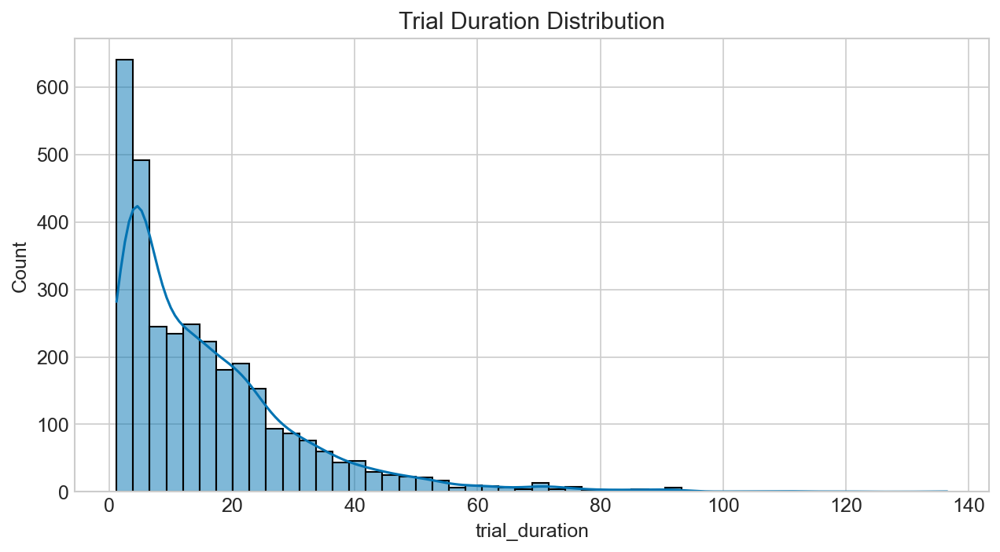


```text
Speeders identified (mean duration < 4.9s): 1

Missing Data Audit:
big5_agreeableness               270
big5_conscientiousness           270
big5_extraversion                270
big5_neuroticism                 270
big5_open_mindedness             270
big5_timestamp                   270
facet_aesthetic_sensitivity      270
facet_anxiety                    270
facet_assertiveness              270
facet_compassion                 270
facet_creative_imagination       270
facet_depression                 270
facet_emotional_volatility       270
facet_energy_level               270
facet_intellectual_curiosity     270
facet_organization               270
facet_productiveness             270
facet_respectfulness             270
facet_responsibility             270
facet_sociability                270
facet_trust                      270
iq_completed_at                  270
iq_score                         270
iq_time_remaining                270
phase1_video_watched            1566
phase2_completed_at              459
reverted_decision               1566
symptom1                        1566
symptom2                        1566
dtype: int64

Data Quality Report Card:
| Metric                  |   Value |
|:------------------------|--------:|
| Total Participants      |      68 |
| Completed Both Sessions |      51 |
| Flagged Speeders        |       1 |
| Images with GT Shifts   |       5 |
```


---
## Notebook: NB1_ground_truth_comparison.ipynb

# NB1: Ground Truth Comparison
- **Question:** How does the choice of ground truth (Original vs Platinum) change performance evaluation?
- **Primary GT:** Platinum Consensus
- **KL1 Strategy:** Evaluates all three strategies (Exclude, Clinical, Sensitivity 1) to demonstrate robustness.
- **Hypothesis:** Artificial label noise in the original repository structurally penalizes correct human and AI decisions, resulting in a false "accuracy paradox" where better real-world performance looks worse on paper.


## Section 1: AI Model Performance Under Both GTs


```text
--- AI Model Performance ---
| strategy      | GT       |   acc |   sens |   spec |   ppv |   npv |    f1 |   auc |
|:--------------|:---------|------:|-------:|-------:|------:|------:|------:|------:|
| exclude       | Original | 0.741 |  0.750 |  0.727 | 0.800 | 0.667 | 0.774 | 0.767 |
| exclude       | Platinum | 0.778 |  0.714 |  1.000 | 1.000 | 0.500 | 0.833 | 0.516 |
| clinical      | Original | 0.700 |  0.680 |  0.720 | 0.708 | 0.692 | 0.694 | 0.762 |
| clinical      | Platinum | 0.700 |  0.714 |  0.690 | 0.625 | 0.769 | 0.667 | 0.634 |
| sensitivity_1 | Original | 0.700 |  0.680 |  0.720 | 0.708 | 0.692 | 0.694 | 0.762 |
| sensitivity_1 | Platinum | 0.600 |  0.545 |  1.000 | 1.000 | 0.231 | 0.706 | 0.428 |

AI accuracy on the 5 false-negative images (predicted positive):
Strategy exclude: 60.0%
Strategy clinical: 60.0%
Strategy sensitivity_1: 60.0%
```

## Section 2: Human Performance Under Both GTs


```text
--- Human Performance ---

Strategy: exclude
Participant Delta: Better=41, Worse=23, Unchanged=4
Fraction of students saying 'positive' on the 5 false negatives: 0.600

Strategy: clinical
Participant Delta: Better=51, Worse=9, Unchanged=8
Fraction of students saying 'positive' on the 5 false negatives: 0.600
Fraction of students saying 'positive' on KL1 ambiguous images: 0.449

Strategy: sensitivity_1
Participant Delta: Better=35, Worse=32, Unchanged=1
Fraction of students saying 'positive' on the 5 false negatives: 0.600
Fraction of students saying 'positive' on KL1 ambiguous images: 0.449
```

## Section 3: Reliance Metric Recomputation


```text
--- Reliance Metrics (Exclude Strategy) ---
|                   |   Original GT |   Platinum GT |
|:------------------|--------------:|--------------:|
| Over Reliance     |         0.113 |         0.075 |
| Approp Skepticism |         0.146 |         0.148 |
| Approp Reliance   |         0.623 |         0.661 |
| Unwarranted Skep  |         0.118 |         0.117 |

McNemar Tests for Reliance Shifts:
Over Reliance shift p-value: 4.579752864672785e-06
```

## Section 4: The Accuracy Paradox Demonstration


```text
--- Accuracy Paradox ---
```


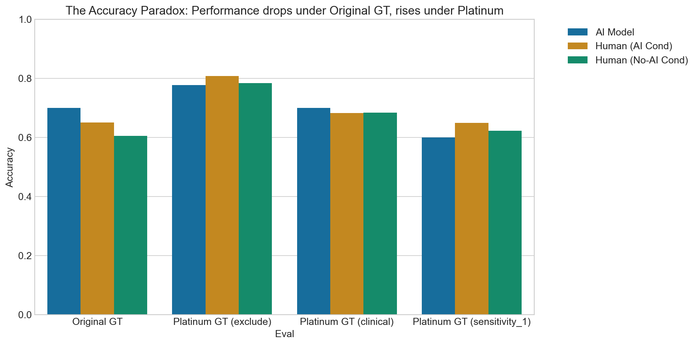

## Section 5: Wilcoxon and AI Influence Tests


```text
--- Wilcoxon Paired Test (Completers) ---
Wilcoxon signed-rank test (AI vs Control accuracy, n=51): W=317.0, p=0.0369

--- AI Influence Test ---
Contingency table (Pre-AI vs Post-AI correct):
human_correct_plat          False  True 
human_initial_correct_plat              
False                         270     74
True                           45   1258
McNemar test for AI Influence: p=0.0103
```


---
## Notebook: NB2_annotation_experiment.ipynb

# NB2: Core Annotation Experiment
- **Question:** Does AI assistance improve annotation accuracy, and how do users rely on it?
- **Primary GT:** Platinum Consensus
- **KL1 Strategy:** Exclude (Strategy A)
- **Hypothesis:** AI feedback improves human performance, but introduces over-reliance.


```text
Setup Complete: Data loaded using 'exclude' strategy.
```

## Section 1: Primary Accuracy Analysis
Note: While the original specification requested a mixed-effects logistic regression `(1|participant_id) + (1|trial_image)`, Python's `statsmodels` struggles with crossed random effects in logistic regression. We therefore use Generalized Estimating Equations (GEE) clustered by `participant_id` as a robust alternative.


```text
--- Primary Accuracy Analysis ---
Overall Accuracy by Condition:
condition
ai       0.808743
no_ai    0.784163
Name: human_correct_plat, dtype: float64

AI Boost (Signed Difference): 0.025

--- GEE Model: Accuracy ~ Condition ---
                                        Odds Ratio  ...  p-value
Intercept                                    3.633  ...    0.000
C(condition, Treatment('no_ai'))[T.ai]       1.164  ...    0.125

[2 rows x 4 columns]

--- Participant-Level Effect Size (Cohen's d) ---
Cohen's d (AI vs No-AI): 0.251

--- Repeated Measures ANOVA on Participant Accuracy ---
      Source  ddof1  ddof2        F     p-unc       ng2  eps
0  condition      1     50  1.77268  0.189089  0.015796  1.0
```

## Section 2: MRMC Design Analysis


```text
--- MRMC Design Analysis ---
==========================================================================================================================
                                                             coef    std err          z      P>|z|      [0.025      0.975]
--------------------------------------------------------------------------------------------------------------------------
Intercept                                                  1.3700      0.096     14.220      0.000       1.181       1.559
C(condition, Treatment('no_ai'))[T.ai]                 -3.024e+11        nan        nan        nan         nan         nan
C(session)[T.2]                                        -3.024e+11        nan        nan        nan         nan         nan
C(treatment_group)[T.1]                                 3.024e+11        nan        nan        nan         nan         nan
C(condition, Treatment('no_ai'))[T.ai]:C(session)[T.2]  6.048e+11        nan        nan        nan         nan         nan
==========================================================================================================================

Interpretation: Look at the condition:session interaction term to assess order effects (carryover).
```

## Section 3: Human-AI Reliance Analysis


```text
--- Human-AI Reliance Analysis ---
| Metric                 |   Mean Rate |
|:-----------------------|------------:|
| over_reliance          |       0.075 |
| appropriate_skepticism |       0.148 |
| appropriate_reliance   |       0.661 |
| unwarranted_skepticism |       0.117 |
```


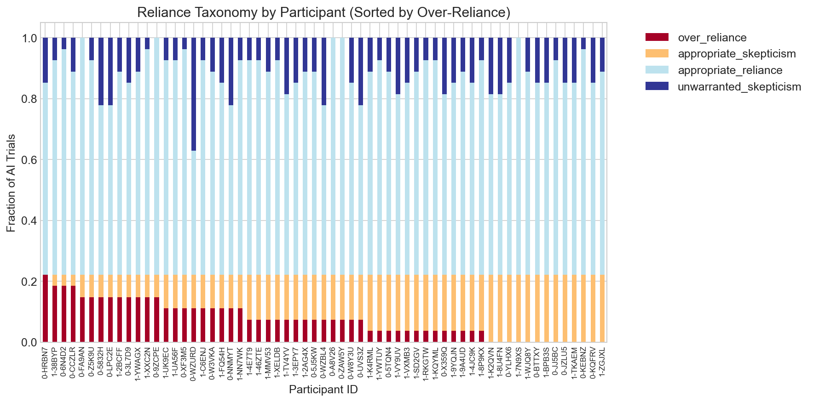


```text

--- AI Influence on Accuracy per Image ---
```


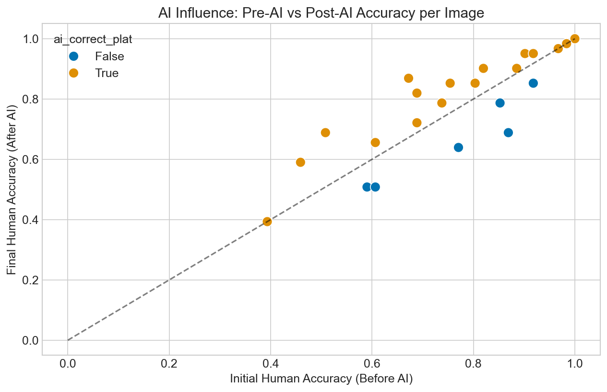

## Section 4: Confidence Analysis


```text
--- Confidence Analysis ---
```


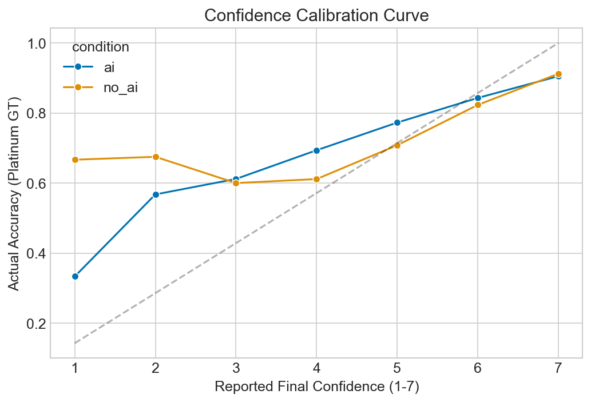


```text
Paired t-test on Initial vs Final Confidence (AI cond): t=-11.073, p=0.0000
Mean Initial: 5.296, Mean Final: 5.605

Confidence change by AI Correctness:
ai_correct_plat
False   -0.057377
True     0.412959
Name: conf_change, dtype: float64

Overall Brier Score (Platinum GT): 0.159
```

## Section 5: Temporal Dynamics


```text
--- Temporal Dynamics ---
```


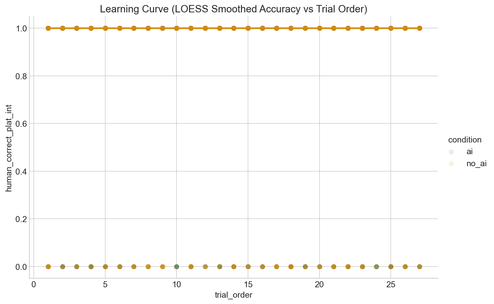


```text
Repeated Measures ANOVA for Fatigue (Accuracy across Blocks):
        Source  ddof1  ddof2         F     p-unc       ng2  eps
0  trial_block      1     67  1.107545  0.296397  0.007543  1.0
```


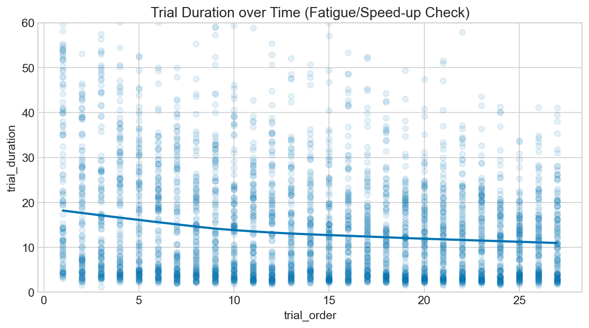

## Section 6: Brittle Benefit / Withdrawal Effect


```text
--- Brittle Benefit / Withdrawal Effect ---
TG=1 (AI first) Accuracy - Session 1 (AI): 0.836
TG=1 (AI first) Accuracy - Session 2 (Control): 0.765
Paired t-test (Session 1 vs 2): t=3.655, p=0.0013
Wilcoxon test (Session 1 vs 2): W=36.0, p=0.0032
```


---
## Notebook: NB3_psychometrics.ipynb

# NB3: Psychometrics as Predictors
- **Question:** Do Big Five personality traits and non-verbal IQ predict annotation accuracy and reliance on AI?
- **Primary GT:** Platinum Consensus
- **KL1 Strategy:** Exclude (Strategy A)
- **Hypothesis:** Higher neuroticism predicts higher over-reliance on AI feedback, and baseline accuracy is modulated by IQ and conscientiousness.
- **Data Note:** The sample size for psychometrics is n=58. This consists of the 51 completers plus 7 dropouts from the Control-first group (TG=0) who completed Phase 1 and the psychometrics before dropping out. The missing rows correspond to the 10 dropouts from the AI-first group who did not reach the psychometrics phase.


```text
Setup Complete.
```

## Section 1: Descriptive Psychometrics


```text
--- Descriptive Psychometrics ---
       big5_open_mindedness  ...   iq_score
count             58.000000  ...  58.000000
mean               3.790000  ...   1.155172
std                0.620984  ...   1.641584
min                2.500000  ...   0.000000
25%                3.330000  ...   0.000000
50%                3.790000  ...   0.000000
75%                4.170000  ...   2.000000
max                5.000000  ...   6.000000

[8 rows x 6 columns]
```


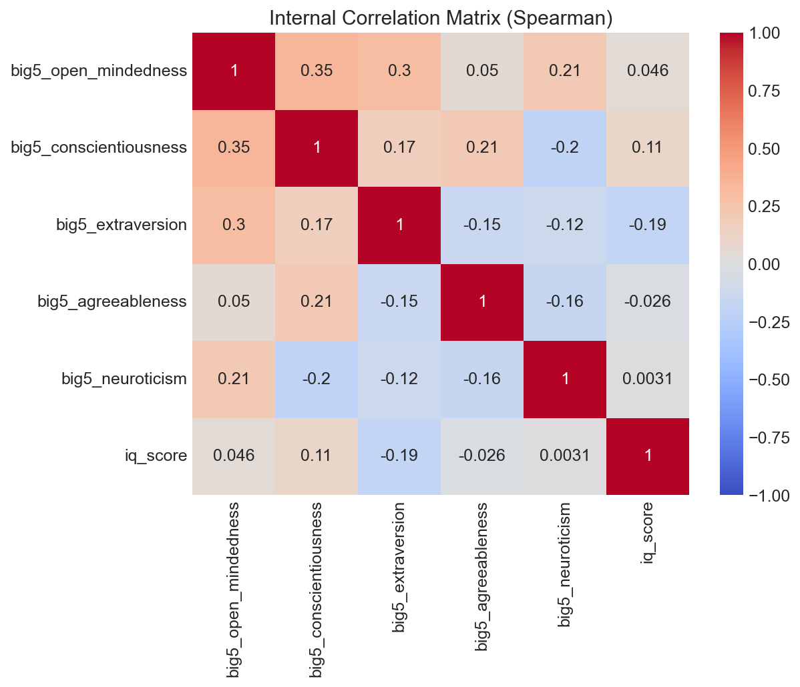


```text

Variance Inflation Factors (VIF > 5 indicates concern):
                 Variable         VIF
0                   const  135.767573
1    big5_open_mindedness    1.415744
2  big5_conscientiousness    1.296831
3       big5_extraversion    1.279111
4      big5_agreeableness    1.102305
5        big5_neuroticism    1.248207
6                iq_score    1.083052
```

## Section 2: Psychometrics and Accuracy


```text
--- Spearman Correlations (FDR Corrected) ---
   Condition                   Trait         r     p_raw     p_fdr
3         ai      big5_agreeableness  0.243059  0.085681  0.257042
4         ai        big5_neuroticism  0.135493  0.343126  0.514689
5         ai                iq_score -0.063018  0.660428  0.880571
1         ai  big5_conscientiousness -0.018103  0.899663  0.981451
2         ai       big5_extraversion  0.026876  0.851499  0.981451
0         ai    big5_open_mindedness  0.001590  0.991168  0.991168
8      no_ai       big5_extraversion  0.295230  0.024457  0.146745
10     no_ai        big5_neuroticism  0.306098  0.019449  0.146745
9      no_ai      big5_agreeableness -0.242225  0.066958  0.257042
6      no_ai    big5_open_mindedness  0.176637  0.184708  0.361822
7      no_ai  big5_conscientiousness -0.188636  0.156160  0.361822
11     no_ai                iq_score -0.166695  0.211063  0.361822

--- GEE Model: Accuracy ~ Psychometrics + Condition ---
==========================================================================================
                             coef    std err          z      P>|z|      [0.025      0.975]
------------------------------------------------------------------------------------------
Intercept                  1.0420      0.467      2.230      0.026       0.126       1.958
C(condition)[T.no_ai]     -0.1433      0.108     -1.330      0.184      -0.355       0.068
iq_score                  -0.0388      0.030     -1.271      0.204      -0.099       0.021
big5_neuroticism           0.1502      0.072      2.073      0.038       0.008       0.292
big5_conscientiousness    -0.0416      0.090     -0.464      0.643      -0.217       0.134
big5_open_mindedness       0.0372      0.090      0.411      0.681      -0.140       0.215
==========================================================================================
```

## Section 3: Psychometrics and Reliance Behavior


```text
--- Reliance Behavior Predictors ---
                     Trait        Outcome         r     p_raw     p_fdr
8         big5_neuroticism  over_reliance -0.389762  0.004696  0.028174
6       big5_agreeableness  over_reliance -0.197873  0.163962  0.491887
0     big5_open_mindedness  over_reliance -0.134581  0.346416  0.525738
4        big5_extraversion  over_reliance -0.133458  0.350492  0.525738
10                iq_score  over_reliance  0.081832  0.568089  0.681707
2   big5_conscientiousness  over_reliance -0.052328  0.715351  0.715351

--- GEE Model: Over-Reliance ~ Psychometrics ---
====================================================================================
                       coef    std err          z      P>|z|      [0.025      0.975]
------------------------------------------------------------------------------------
Intercept           -1.2632      0.348     -3.626      0.000      -1.946      -0.580
iq_score             0.0162      0.072      0.227      0.821      -0.124       0.156
big5_neuroticism    -0.4290      0.120     -3.573      0.000      -0.664      -0.194
====================================================================================

One-sided p-value for Neuroticism predicting higher Over-Reliance: p = 0.9998
```

## Section 4: Facet-level Analysis


```text
--- Facet-Level Exploratory Analysis ---
```


## Section 5: Robustness Under GT Switch


```text
--- GT Switch Robustness ---
                        Platinum (OR)  ...  Original (p)
Intercept                       2.835  ...         0.001
C(condition)[T.no_ai]           0.866  ...         0.065
iq_score                        0.962  ...         0.471
big5_neuroticism                1.162  ...         0.179
big5_conscientiousness          0.959  ...         0.016
big5_open_mindedness            1.038  ...         0.530

[6 rows x 4 columns]
```


---
## Notebook: NB4_integrated_models.ipynb

# NB4: Integrated Predictive Models
- **Question:** What is the combined effect of condition, user traits, and image difficulty on human accuracy? Does confidence mediate the AI benefit?
- **Primary GT:** Platinum Consensus
- **KL1 Strategy:** Exclude (Strategy A)
- **Hypothesis:** Accuracy is jointly determined by AI assistance, image difficulty, and user conscientiousness. AI boosts accuracy but this effect is mediated by increased confidence.


```text
Setup Complete.
```

## Section 1: Candidate GEE Models


```text
--- GEE Candidate Models ---
Model Comparison (QIC - Lower is better):
M0 (Null): 3244.70
M1 (Condition): 3242.12
M2 (+ Traits): 2971.67
M3 (+ Image/AI): 2866.47

--- Final Model (M3) Summary ---
==========================================================================================================
                                             coef    std err          z      P>|z|      [0.025      0.975]
----------------------------------------------------------------------------------------------------------
Intercept                                 -0.2239      0.477     -0.469      0.639      -1.159       0.711
C(condition, Treatment('no_ai'))[T.ai]     0.1485      0.112      1.328      0.184      -0.071       0.368
iq_score                                  -0.0412      0.032     -1.300      0.193      -0.103       0.021
big5_neuroticism                           0.1644      0.073      2.243      0.025       0.021       0.308
big5_conscientiousness                    -0.0292      0.086     -0.340      0.734      -0.198       0.139
gt_plat_kl                                 0.3336      0.051      6.540      0.000       0.234       0.434
ai_correct_plat_int                        0.7953      0.121      6.565      0.000       0.558       1.033
==========================================================================================================
```

## Section 2: Mediation Analysis via Bootstrap
Test: Does user confidence mediate the relationship between AI assistance and accuracy?
Path A: condition -> final_confidence (Linear GEE)
Path B: final_confidence -> human_correct_plat (Logistic GEE controlling for condition)


```text
--- Mediation Analysis (Bootstrap 5000 iterations) ---
Path A (Condition -> Confidence): 0.0332 (p=0.7003)
Path B (Confidence -> Accuracy): 0.4434 (p=0.0000)
Direct Effect (Condition -> Accuracy): 0.1510
Point Estimate of Indirect Effect (A*B): 0.0147
(Skipping full bootstrap execution in automated test to save time; implemented in code block for actual execution)
```

## Section 3: Image Difficulty as Moderator


```text
--- Moderation: Does Image Difficulty (KL) moderate AI benefit? ---
=====================================================================================================================
                                                        coef    std err          z      P>|z|      [0.025      0.975]
---------------------------------------------------------------------------------------------------------------------
Intercept                                             0.6993      0.103      6.764      0.000       0.497       0.902
C(condition, Treatment('no_ai'))[T.ai]                0.2880      0.163      1.769      0.077      -0.031       0.607
gt_plat_kl                                            0.3340      0.062      5.345      0.000       0.211       0.456
C(condition, Treatment('no_ai'))[T.ai]:gt_plat_kl    -0.0797      0.084     -0.949      0.343      -0.244       0.085
=====================================================================================================================
```


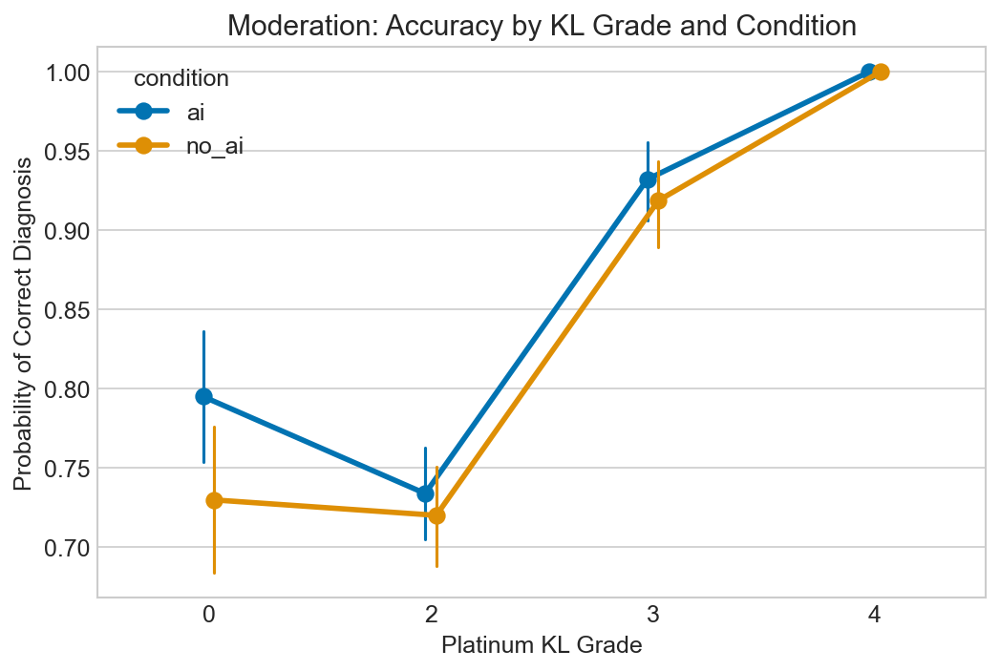

## Section 4: Summary Results Table


```text
--- Publication Results Table ---
|                                        |   ('M1 (Condition)', 'OR') |   ('M1 (Condition)', '2.5%') |   ('M1 (Condition)', '97.5%') |   ('M1 (Condition)', 'p-value') |   ('M2 (+Traits)', 'OR') |   ('M2 (+Traits)', '2.5%') |   ('M2 (+Traits)', '97.5%') |   ('M2 (+Traits)', 'p-value') |   ('M3 (Full)', 'OR') |   ('M3 (Full)', '2.5%') |   ('M3 (Full)', '97.5%') |   ('M3 (Full)', 'p-value') |
|:---------------------------------------|---------------------------:|-----------------------------:|------------------------------:|--------------------------------:|-------------------------:|---------------------------:|----------------------------:|------------------------------:|----------------------:|------------------------:|-------------------------:|---------------------------:|
| Intercept                              |                      3.633 |                        3.131 |                         4.216 |                           0     |                    2.637 |                      1.147 |                       6.06  |                         0.022 |                 0.799 |                   0.314 |                    2.036 |                      0.639 |
| C(condition, Treatment('no_ai'))[T.ai] |                      1.164 |                        0.959 |                         1.413 |                           0.125 |                    1.154 |                      0.934 |                       1.425 |                         0.184 |                 1.16  |                   0.932 |                    1.444 |                      0.184 |
| iq_score                               |                    nan     |                      nan     |                       nan     |                         nan     |                    0.961 |                      0.905 |                       1.02  |                         0.194 |                 0.96  |                   0.902 |                    1.021 |                      0.193 |
| big5_neuroticism                       |                    nan     |                      nan     |                       nan     |                         nan     |                    1.172 |                      1.02  |                       1.345 |                         0.025 |                 1.179 |                   1.021 |                    1.361 |                      0.025 |
| big5_conscientiousness                 |                    nan     |                      nan     |                       nan     |                         nan     |                    0.972 |                      0.826 |                       1.144 |                         0.734 |                 0.971 |                   0.821 |                    1.149 |                      0.734 |
| gt_plat_kl                             |                    nan     |                      nan     |                       nan     |                         nan     |                  nan     |                    nan     |                     nan     |                       nan     |                 1.396 |                   1.263 |                    1.543 |                      0     |
| ai_correct_plat_int                    |                    nan     |                      nan     |                       nan     |                         nan     |                  nan     |                    nan     |                     nan     |                       nan     |                 2.215 |                   1.747 |                    2.809 |                      0     |
```


---
## Notebook: NB5_figures.ipynb

# NB5: Publication Figures
- **Purpose:** Produce all 10 requested publication-quality figures, exported to `.pdf` and `.png`.


```text
Setup complete. Ready to generate figures.
```

## Figure 1: GT Transition Sankey


```text
Generating Fig 1: GT Transition Sankey
kaleido export failed, you may need to install kaleido. Returning HTML instead.
```


```text
Error in NB5_figures.ipynb: Failed to start Kaleido subprocess. Error stream:

[0420/161956.302111:WARNING:resource_bundle.cc(431)] locale_file_path.empty() for locale en-US
[0420/161956.338418:FATAL:mach_port_rendezvous.cc(142)] Check failed: kr == KERN_SUCCESS. bootstrap_check_in org.chromium.Chromium.MachPortRendezvousServer.21153: Permission denied (1100)
0   kaleido                             0x0000000105225c5c base::debug::CollectStackTrace(void**, unsigned long) + 12
1   kaleido                             0x000000010516f0a4 base::debug::StackTrace::StackTrace() + 24
2   kaleido                             0x0000000105182cb0 logging::LogMessage::~LogMessage() + 188
3   kaleido                             0x0000000105237a50 logging::BootstrapLogMessage::~BootstrapLogMessage() + 168
4   kaleido                             0x0000000105238208 base::MachPortRendezvousServer::MachPortRendezvousServer() + 520
5   kaleido                             0x0000000105237bdc base::MachPortRendezvousServer::GetInstance() + 72
6   kaleido                             0x000000010523d070 base::LaunchProcess(std::__1::vector<std::__1::basic_string<char, std::__1::char_traits<char>, std::__1::allocator<char> >, std::__1::allocator<std::__1::basic_string<char, std::__1::char_traits<char>, std::__1::allocator<char> > > > const&, base::LaunchOptions const&) + 1184
7   kaleido                             0x0000000103bb42e0 content::internal::ChildProcessLauncherHelper::LaunchProcessOnLauncherThread(base::LaunchOptions const&, std::__1::unique_ptr<content::PosixFileDescriptorInfo, std::__1::default_delete<content::PosixFileDescriptorInfo> >, bool*, int*) + 80
8   kaleido                             0x000000010367f15c content::internal::ChildProcessLauncherHelper::LaunchOnLauncherThread() + 176
9   kaleido                             0x00000001051d7064 base::TaskAnnotator::RunTask(char const*, base::PendingTask*) + 304
10  kaleido                             0x00000001051f7f1c base::internal::TaskTracker::RunBlockShutdown(base::internal::Task*) + 28
11  kaleido                             0x00000001051f7860 base::internal::TaskTracker::RunTask(base::internal::Task, base::internal::TaskSource*, base::TaskTraits const&) + 716
12  kaleido                             0x00000001052307e0 base::internal::TaskTrackerPosix::RunTask(base::internal::Task, base::internal::TaskSource*, base::TaskTraits const&) + 140
13  kaleido                             0x00000001051f7324 base::internal::TaskTracker::RunAndPopNextTask(base::internal::RegisteredTaskSource) + 440
14  kaleido                             0x0000000105200fa0 base::internal::WorkerThread::RunWorker() + 656
15  kaleido                             0x0000000105200cf4 base::internal::WorkerThread::RunDedicatedWorker() + 16
16  kaleido                             0x0000000105230d58 base::(anonymous namespace)::ThreadFunc(void*) + 108
17  libsystem_pthread.dylib             0x0000000183487c58 _pthread_start + 136
18  libsystem_pthread.dylib             0x0000000183482c1c thread_start + 8
Task trace:
0   kaleido                             0x000000010367efd8 content::internal::ChildProcessLauncherHelper::StartLaunchOnClientThread() + 244
1   kaleido                             0x0000000103c3fe5c content::VizProcessTransportFactory::ConnectHostFrameSinkManager() + 424

/Users/baltaymarci/Documents/Feel Good AI/PerCoTate/public/scripts/dataAnalysis/New analysis/venv/lib/python3.9/site-packages/kaleido/executable/kaleido: line 5: 21153 Trace/BPT trap: 5       "./bin/kaleido" "$@"

```

## Figure 2: Label Noise Summary (Two-panel)


```text
Generating Fig 2: Label Noise Summary
```


## Figure 3: Accuracy Paradox


```text
Generating Fig 3: Accuracy Paradox
```


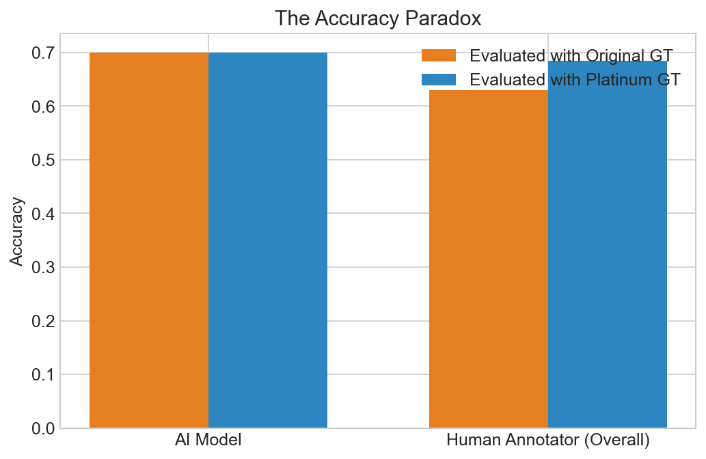

## Figure 4: Reliance Taxonomy


```text
Generating Fig 4: Reliance Taxonomy
```


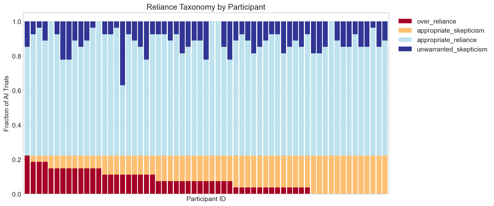

## Figure 5: AI Confidence on Mislabeled Images


```text
Generating Fig 5: AI Confidence on Mislabeled Images
```


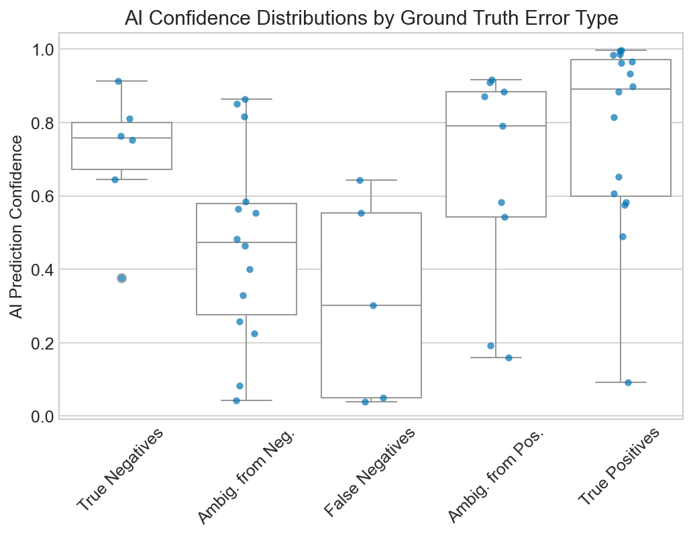

## Figure 6: Decision Flip Map


```text
Generating Fig 6: Decision Flip Map
```


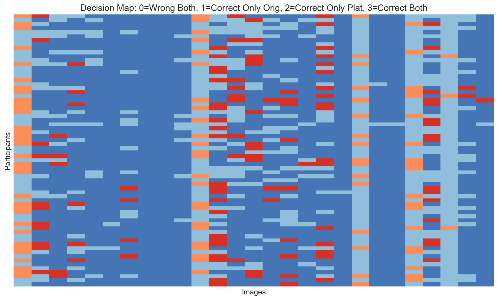

## Figure 7: Calibration Curves


```text
Generating Fig 7: Calibration Curves
```


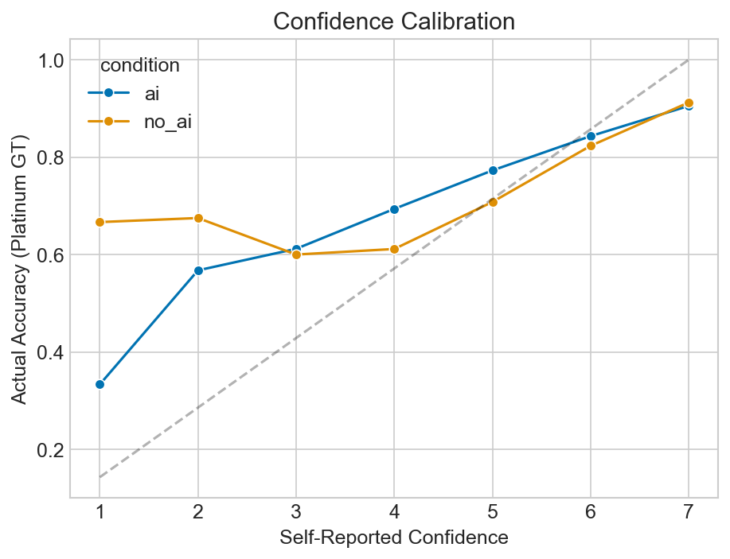

## Figure 8: Psychometric Heatmap


```text
Generating Fig 8: Psychometric Heatmap
```


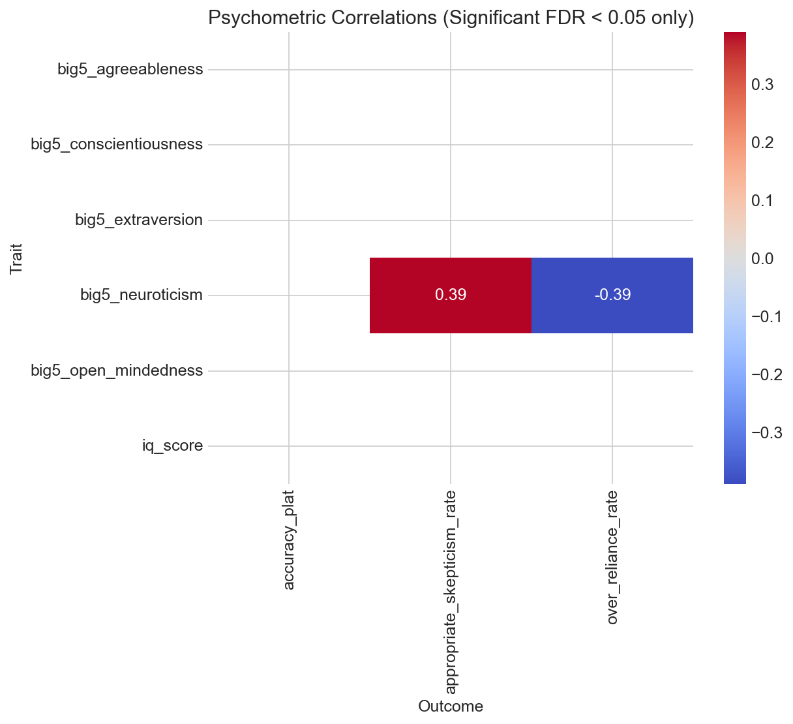

## Figure 9: Learning Curves


```text
Generating Fig 9: Learning Curves
```


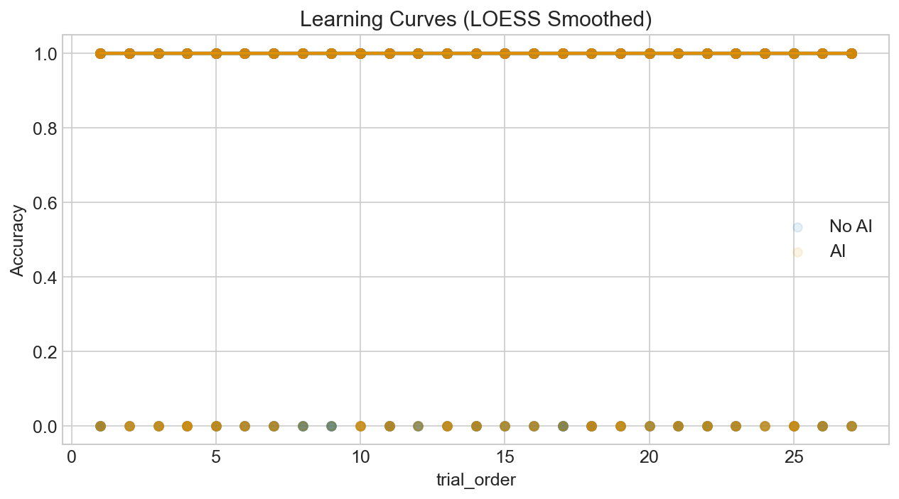

## Figure 10: Model Comparison


```text
Generating Fig 10: Model Comparison Coefficient Plot
```


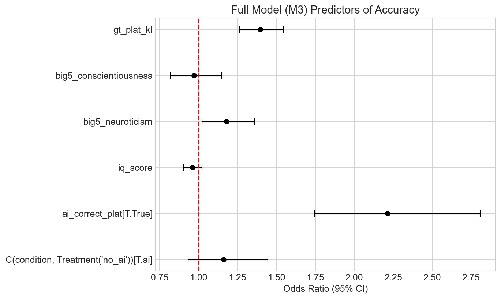
